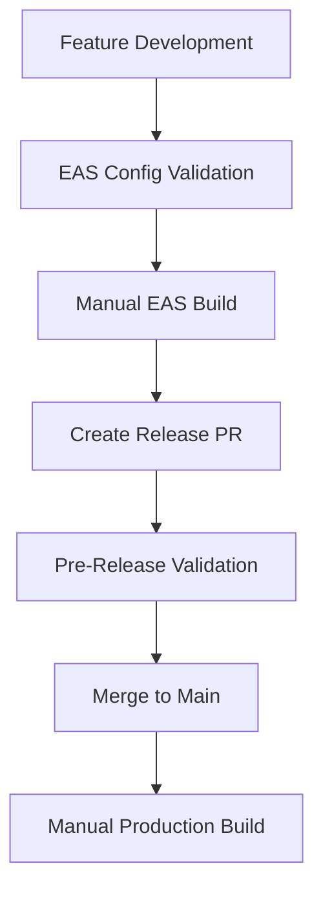
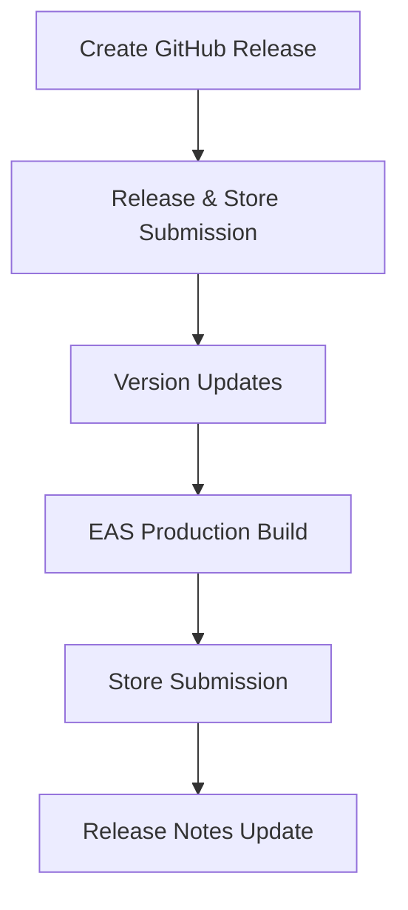
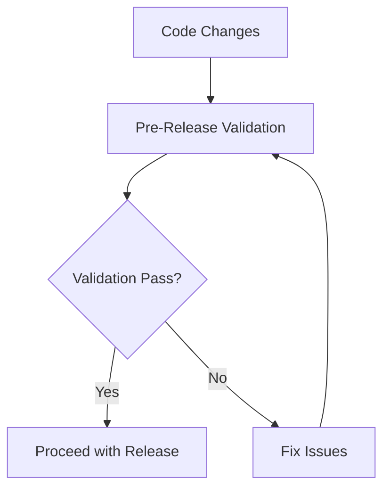

# 🔄 GitHub Actions Workflows Documentation

## 📋 **Overview**

This repository uses **5 specialized GitHub Actions workflows** to handle different aspects of the CI/CD pipeline for the Open Bible Stories mobile app.

## 🎯 **Workflow Summary**

| Workflow | Purpose | Trigger | Output |
|----------|---------|---------|---------|
| [Manual & Production Builds](#1-manual--production-builds) | EAS builds for testing + automatic production | Manual + Push to `main` | EAS builds |
| [Release Store Submission](#2-release--store-submission) | Release-triggered builds with store submission | GitHub releases | Store-ready apps |
| [Pre-Release Validation](#3-pre-release-validation) | Validates releases before deployment | PRs to `main` + Tags | Validation results |
| [EAS Config Validation](#4-eas-config-validation) | Tests EAS setup and configuration | Feature branches | Setup validation |
| [Native Android Build](#5-native-android-build) | Alternative native Android builds | Manual + Tags | Native APK files |

---

## 🚀 **1. Manual & Production Builds**

**File**: `.github/workflows/eas-build-only.yml`
**Name**: `EAS Build - Manual & Production`

### **Purpose**

- **Manual builds** for testing features, releases, and hotfixes
- **Automatic production builds** when code is pushed to `main` branch
- **Free plan optimized** - conservative build strategy

### **When It Triggers**

```yaml
# Automatic triggers
push:
  branches: [main]              # Production builds only

# Manual triggers
workflow_dispatch:              # Manual builds for any branch
```

### **What It Does**

1. ✅ **Validates** EXPO_TOKEN exists
2. ✅ **Builds** with EAS using specified platform/profile
3. ✅ **Supports** any branch, platform, and build profile
4. ✅ **Provides** detailed build information and monitoring links

### **How to Use**

#### **Automatic (Production)**

```bash
# This triggers automatic production build:
git push origin main
```

#### **Manual Testing**

1. Go to **Actions** → **"EAS Build - Manual & Production"**
2. Click **"Run workflow"**
3. Choose:
   - **Platform**: `android`, `ios`, or `all`
   - **Profile**: `development`, `preview`, or `production`
   - **Branch**: Leave empty for current, or specify branch name

#### **Common Scenarios**

```bash
# Test feature branch
Platform: android, Profile: preview, Branch: feature/my-feature

# Release candidate testing
Platform: all, Profile: production, Branch: release/v1.2.0

# Quick development build
Platform: android, Profile: development, Branch: develop
```

---

## 🏪 **2. Release & Store Submission**

**File**: `.github/workflows/eas-release-store-submission.yml`
**Name**: `EAS Build and Store Submission`

### **Purpose**

- **Automatic builds and store submission** when GitHub releases are published
- **Version management** - automatically updates app.json and package.json
- **Release enhancement** - adds build information to GitHub releases

### **When It Triggers**

```yaml
# Automatic triggers
release:
  types: [published]            # When you publish a GitHub release

# Manual triggers
workflow_dispatch:              # Manual testing of release process
```

### **What It Does**

1. ✅ **Extracts version** from release tag (`v1.2.0` → `1.2.0`)
2. ✅ **Updates versions** in app.json and package.json
3. ✅ **Auto-increments** Android versionCode and iOS buildNumber
4. ✅ **Creates production builds** for specified platforms
5. ✅ **Submits to app stores** (Apple App Store + Google Play)
6. ✅ **Updates release notes** with build information and download links

### **How to Use**

#### **Automatic (Recommended)**

```bash
# 1. Create GitHub release with semantic version tag
Tag: v1.2.0
Target: main
Title: "v1.2.0 - Feature Release"
Description: [Your release notes]

# 2. Click "Publish release"
# → Workflow automatically triggers
# → Builds and submits to stores
# → Updates release with build info
```

#### **Manual Testing**

1. Go to **Actions** → **"EAS Build and Store Submission"**
2. Click **"Run workflow"**
3. Choose:
   - **Submit to stores**: `true` or `false`
   - **Platform**: `android`, `ios`, or `all`

### **Version Management**

The workflow automatically manages versions:

```json
// app.json - Updated automatically
{
  "expo": {
    "version": "1.2.0",           // From release tag
    "android": {
      "versionCode": 123          // Auto-incremented
    },
    "ios": {
      "buildNumber": "124"        // Auto-incremented
    }
  }
}
```

---

## ✅ **3. Pre-Release Validation**

**File**: `.github/workflows/release-validation.yml`
**Name**: `Release Validation`

### **Purpose**

- **Validates configuration** before releases go live
- **Ensures consistency** between app.json, package.json, and tags
- **Quality checks** before production deployment

### **When It Triggers**

```yaml
# Automatic triggers
pull_request:
  branches: [main]              # PRs to main (release PRs)
  paths: [app.json, package.json, CHANGELOG.md, eas.json]

push:
  tags: ['v*']                  # Version tags before releases
```

### **What It Does**

1. ✅ **Validates JSON** syntax in app.json and eas.json
2. ✅ **Checks version formats** (semantic versioning)
3. ✅ **Ensures version consistency** across files and tags
4. ✅ **Validates EAS configuration** and build profiles
5. ✅ **Checks CHANGELOG.md** for release notes
6. ✅ **Runs lint and type checks** if configured

### **How to Use**

#### **Automatic Validation**

```bash
# Triggers automatically when:
# 1. Creating PR to main (release PR)
git checkout -b release/v1.2.0
# ... make changes ...
# Create PR: release/v1.2.0 → main

# 2. Pushing version tags
git tag v1.2.0
git push origin v1.2.0
```

#### **What Gets Validated**

- **JSON Format**: All config files are valid JSON
- **Version Format**: Follows semantic versioning (1.2.3)
- **Version Consistency**: app.json, package.json, and tags match
- **EAS Config**: Build profiles exist and are properly configured
- **Code Quality**: Linting and type checking (if available)

---

## 🔧 **4. EAS Config Validation**

**File**: `.github/workflows/eas-config-validation.yml`
**Name**: `Test EAS Setup`

### **Purpose**

- **Tests EAS configuration** and setup
- **Validates configuration files** without building
- **Provides setup guidance** for administrators

### **When It Triggers**

```yaml
# Automatic triggers
push:
  branches: [feature/eas-configuration, feature/github-setup-checklist]

# Manual triggers
workflow_dispatch:              # Manual validation testing
```

### **What It Does**

1. ✅ **Validates eas.json** structure and JSON syntax
2. ✅ **Checks app.json** configuration
3. ✅ **Tests EAS CLI** installation and functionality
4. ✅ **Lists build profiles** available
5. ✅ **Provides next steps** for complete setup

### **How to Use**

#### **Automatic Testing**

```bash
# Triggers automatically on specific feature branches:
git push origin feature/eas-configuration
git push origin feature/github-setup-checklist
```

#### **Manual Testing**

1. Go to **Actions** → **"Test EAS Setup"**
2. Click **"Run workflow"**
3. Review validation results

#### **When to Use**

- **After EAS configuration changes** - Verify setup is correct
- **During initial setup** - Ensure everything works before first build
- **Troubleshooting** - Debug EAS configuration issues

---

## 📱 **5. Native Android Build**

**File**: `.github/workflows/native-android-build.yml`
**Name**: `Build Android Release`

### **Purpose**

- **Alternative Android builds** using native build process (not EAS)
- **Direct APK generation** for distribution
- **Automatic GitHub releases** with attached APK files

### **When It Triggers**

```yaml
# Automatic triggers
push:
  tags: ['v*.*.*']              # Semantic version tags

# Manual triggers
workflow_dispatch:              # Manual APK builds
```

### **What It Does**

1. ✅ **Native Android build** using Gradle and React Native CLI
2. ✅ **Version management** with optional version bumping
3. ✅ **APK generation** with versioned filenames
4. ✅ **GitHub release creation** with APK attachment
5. ✅ **Ministry-focused release notes** with installation instructions

### **How to Use**

#### **Automatic APK Releases**

```bash
# Create and push version tag:
git tag v1.2.3
git push origin v1.2.3

# → Builds APK
# → Creates GitHub release
# → Attaches obs-app-v1.2.3.apk
```

#### **Manual APK Builds**

1. Go to **Actions** → **"Build Android Release"**
2. Click **"Run workflow"**
3. Choose:
   - **Version bump**: `patch`, `minor`, `major`, or `none`
   - **Create release**: `true` to create GitHub release with APK

#### **Output Files**

- **`obs-app-v1.2.3.apk`** - Ready-to-install Android app
- **`build-info.json`** - Build metadata
- **`RELEASE-NOTES.md`** - Installation instructions

---

## 🔗 **How Workflows Work Together**

### **Development Workflow**



### **Release Workflow**



### **Quality Assurance Flow**



---

## 📊 **Workflow Comparison**

### **Build Methods**

| Method | Speed | Use Case | Output | Cost |
|--------|-------|----------|--------|------|
| **EAS Build** | Medium | Most scenarios | Optimized builds | EAS credits |
| **Native Build** | Fast | APK distribution | Direct APK | GitHub minutes |

### **Trigger Types**

| Trigger | Workflows | Purpose |
|---------|-----------|---------|
| **Push to main** | Manual & Production | Production builds |
| **GitHub Release** | Release & Store Submission | Store deployment |
| **PR to main** | Pre-Release Validation | Quality assurance |
| **Manual** | All workflows | Testing & debugging |
| **Version Tags** | Release Validation, Native Build | Release preparation |

---

## 🚨 **Required Setup**

### **Essential Secrets**

```bash
# Required for ALL EAS workflows
EXPO_TOKEN=xxx                  # Get from expo.dev account settings

# Optional for store submission
APPLE_ID=developer@unfoldingword.org
ASC_APP_ID=1234567890
APPLE_TEAM_ID=ABCD123456
GOOGLE_PLAY_SERVICE_ACCOUNT_KEY=xxx
```

### **Permissions**

- **GitHub Actions**: Read/write repository access
- **Expo Account**: unfoldingword organization access
- **Store Accounts**: Developer account access (optional)

---

## 💡 **Best Practices**

### **Workflow Selection**

```bash
# Feature testing → Manual EAS Build
# Release candidates → Manual EAS Build (production profile)
# Store releases → GitHub Release (automatic store submission)
# APK distribution → Native Android Build
# Configuration testing → EAS Config Validation
```

### **Free Plan Optimization**

- Use **Manual & Production Builds** for most scenarios
- Trigger **Release & Store Submission** only for actual releases
- Use **Native Android Build** for quick APK generation
- Leverage **validation workflows** to catch issues early

### **Monitoring**

- **EAS Builds**: <https://expo.dev/accounts/unfoldingword/projects/obs-app>
- **GitHub Actions**: Repository → Actions tab
- **Store Status**: App Store Connect & Google Play Console

---

## 📞 **Support & Troubleshooting**

### **Common Issues**

- **Missing EXPO_TOKEN**: Add secret in repository settings
- **Failed builds**: Check EAS quota and configuration
- **Store submission errors**: Verify store credentials
- **Version conflicts**: Use Pre-Release Validation workflow

### **Getting Help**

- **Workflow logs**: Available in GitHub Actions tab
- **EAS logs**: Available on expo.dev dashboard
- **Documentation**: See repository docs folder

---

**🚀 Ready to ship God's Word to the world with automated confidence!**
